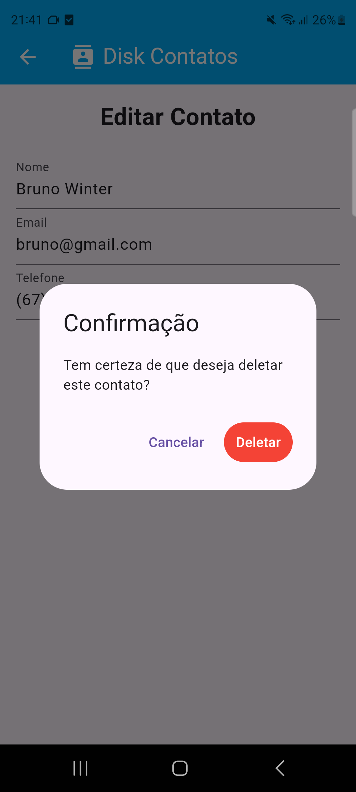

# Agenda de Contatos

Projeto feito para materia de Desenvolvimento Mobile, para a Faculdade.


# Requisitos e Instalacao

- Ter um dispositivo móvel para emular.
- Flutter e Dart instalados.
- Baixar as dependências com ``` flutter pub get ```.
- Rodar a aplicação com ``` flutter run ```.


# Imagens

## Tela de Listagem de Contatos


## Tela de Cadastro


## Tela de Editar Contato


## Telas de Confirmações

### Deletar


### Editar


